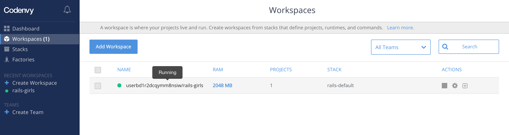
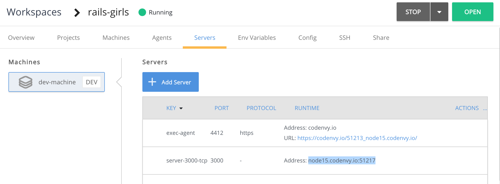

# Web-based

Instead of installing Ruby on Rails and an editor on your computer, you can use a webservice for development. All you need is a browser and an internet connection. This guide explains how to get started with [codenvy.io](https://codenvy.io/). If you’re using a different service, they may use a different wording, but the process is usually pretty similar.

## _1._ Update your browser

If you use Internet Explorer, we recommend installing [Firefox](http://guides.railsgirls.com/mozilla.org/firefox) or [Google Chrome](http://guides.railsgirls.com/google.com/chrome).

Open [whatbrowser.org](http://whatbrowser.org/) and update your browser if you don’t have the latest version.

## _2._ Create an account

Go to [codenvy.io](https://codenvy.io/) and signup for free. You will need to confirm your email and then fill in your details.

## _3._ Setup a workspace for Ruby on Rails

The Ruby on Rails Workspace has all the software we need for the workshop already preinstalled. To create a workspace, log into [codenvy.io](https://codenvy.io/) and click on ‘Dashboard’. If no workspace has been created yet, the ‘New Workspace’ view is displayed.

In the ‘New Workspace’ view, a few settings have to be made.

* Give the workspace a name of your choice. In the example this is “railsgirls”.
* From “Select Stack”, select “Quick Start”, scroll down and select “Rails”
* Now click on ‘Create’ to create the workspace \(it takes a moment for the process to finish\)

* Codenvy creates a folder ‘/projects’ during initialization, in which you can later put your code.

## _4._ Find and restart your workspace

* If you’ve just created your project, you can probably skip these steps - they’re good to know if you login to Codenvy again later
* If you haven’t used your workspace or projects in a while, they might have been shutdown due to inactivity. You will notice an empty circle displayed next to the workspace name.

* In this case simply click on the name of the workspace. It will then be restarted \(which can take a while\) and afterwards opened.
* If you have restarted a workspace, you need to run the `bundle` command again in the directory of your Rails project \(you will learn more about the command in the app tutorial\)

## _5._ Coding with your project

* On the left hand side, you find a file browser where you can navigate your directories and file
* In the middle, you find the editor where you can modify your files
* At the bottom, you find the terminal where you can run commands
* Everything you need is right here in you browser window - you do not need to start an editor or terminal anywhere else
* If you are following a guide or tutorial, use the commands for Linux even if you are on a Windows computer - your operating system does not matter, since all commands are run on your project’s machine in the cloud, which is running Linux

### Starting the Rails Server

* If a guide or tutorial asks you to run a rails command that contains `rails` or `rake`, prepend `bundle exec` to this command, e. g. `bundle exec rails db:migrate`. Exception: the `rails new` command is not prefixed.
* If a guide or tutorial asks you to start the rails server with `rails server` or `rails s`, append `-b 0.0.0.0` to this command so that you run `rails server -b 0.0.0.0`
* If a guide or tutorial asks you to point your browser to something like `http://localhost:3000`, follow these instructions instead:
  * Go to ‘[Workspaces](https://codenvy.io/dashboard/#/workspaces)’ and click your running workspace 

* Click 'Servers' and  copy the Address entry in the line starting with ‘server-3000-tcp

For example, if the tutorial wants you to visit `http://localhost:3000/posts`, you would open the URL `http://node3.codenvy.io:33079/posts` instead.

## 6. Go through the Workshop Guides

[https://railsgirlskc.gitbook.io/workshop-guide/](https://railsgirlskc.gitbook.io/workshop-guide/)

