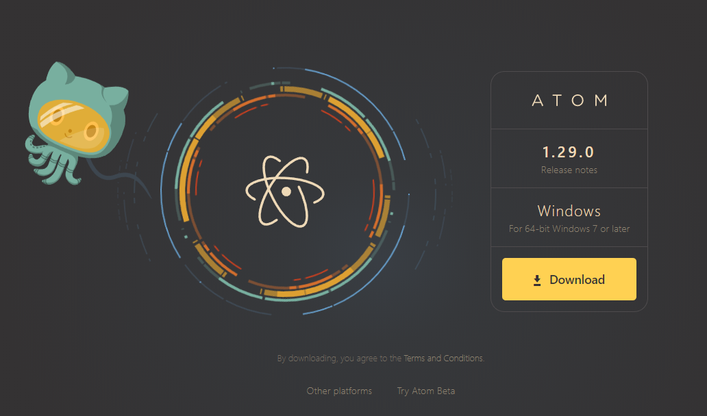
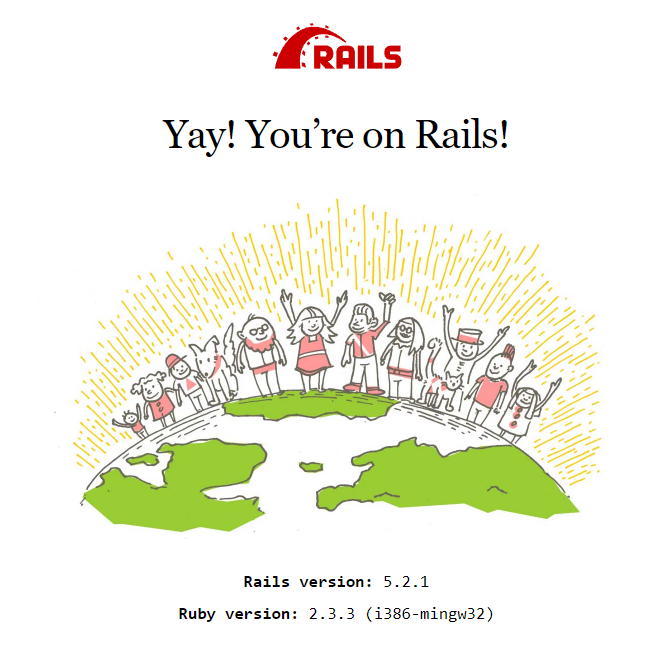

# Windows

Last year's installation instructions are a bit outdated.  They're still posted below, but we're going to work with the updated ruby 2.6.5 and rails 6.0.0 this year.

This article is a very well filled out guide on how to install rails 6.0.0 on windows 7, 8, and 10

[https://medium.com/ruby-on-rails-web-application-development/how-to-install-rubyonrails-on-windows-7-8-10-complete-tutorial-2017-fc95720ee059](https://medium.com/ruby-on-rails-web-application-development/how-to-install-rubyonrails-on-windows-7-8-10-complete-tutorial-2017-fc95720ee059)

## Last year's guide:

## 1. Install Rails

Download [RailsInstaller](https://s3.amazonaws.com/railsinstaller/Windows/railsinstaller-3.4.0.exe) and run it. Click through the installer using the default options.

### **1a. Enable copy and paste in Windows Command Prompt**

Test if you can use the ctrl button to copy and paste in the terminal, if not try these steps:

Open `Command Prompt with Ruby and Rails`. Right-click on the command prompt’s title bar, and choose “Properties”. Navigate to the “experimental” tab, and check the “Enable new Ctrl key shortcuts” option \(you may need to check the “Enable experimental console features” option first\).

Otherwise:

To paste a text in the command prompt window you’ll need to use the mouse \(right-click on the window –&gt; paste\).

### **1b. Install Rails**

In the `Command Prompt with Ruby and Rails`, run the following command:

```text
rails -v
```

If you see the following message:

```text
the system cannot find the path specified
```

This can happen when the installer cannot correctly setup the paths required to run rails. It’s nothing serious, we can fix this in different ways but the easiest is by manually installing the rails gem with the following command:

```text
gem install rails bundler --no-document
```

This will \(re\)install rails correctly and running:

```text
rails -v
```

Should print the currently installed rails version number \(your version may differ\):

```text
Rails 5.2.1
```

If the Rails version is less than 5.1, update it using a following command:

```text
gem update rails --no-document
```

## Testing your Install - Possible errors

### run `rails new testapp`

If you don't get an error, move down to  [Run bundle install](windows.md#run-bundle-install)

If you get an error stating `Gem::RemoteFetcher`:

```text
Gem::RemoteFetcher::FetchError: SSL_connect returned=1 errno=0 state=SSLv3 read
server certificate B: certificate verify failed (https://rubygems.org/gems/i18n-0.6.11.gem)
```

This means you have an older version of Rubygems and will need to update it manually first verify your Rubygems version

```text
gem -v
```

If it is lower than `2.6.5` you will need to manually update it:

```text
gem update --system
```

Check your version of rubygems

```text
gem -v
```

Make sure it is equal or higher than `2.6.11`. Re-run the command that was failing previously.

If you are still running into problems you can always find the latest version of rubygems online at [rubygems.org](https://rubygems.org/pages/download). If you click on **GEM** you will get the latest version.

### Run `bundle install`

If you don't get an error, jump down to [Installing a text editor](windows.md#2-install-a-text-editor-to-edit-code-files) 

The `Gem::RemoteFetcher::FetchError: SSL_connect` can also occur during the `bundle install` stage when creating a new rails app.

The error will make mention of [bit.ly/ruby-ssl](http://bit.ly/ruby-ssl). What is relevant for Windows users at this point is [this GitHub gist](https://gist.github.com/867550). The described manual way has proven to be successful to solve the `bundle install` error.

#### ‘x64\_mingw’ is not a valid platform\` Error <a id="x64_mingw-is-not-a-valid-platform-error"></a>

Sometimes you get the following error when running `rails server`: `'x64_mingw' is not a valid platform` If you experience this error after using the RailsInstaller you have to do a small edit to the file `Gemfile`:

Look at the bottom of the file. You will probably see something like this as one of the last lines in the file:`gem 'tzinfo-data', platforms: [:mingw, :mswin, :x64_mingw]`. If you have this line with `:x64_mingw`, then please delete the `:x64_mingw`part. In the end it should just say: `'tzinfo-data', platforms: [:mingw, :mswin]`

After you did that, please use your Command Prompt again and type `bundle update`.

## 2. Install a text editor to edit code files

For the workshop we recommend the text editor Atom.

Visit the[ atom.io](https://atom.io/) website to download and install the latest version.



If you are using Windows Vista or older versions, you can use another editor [Sublime Text 2](http://www.sublimetext.com/2). 

## 3. Update your browser

If you use Internet Explorer, we recommend installing [Firefox](http://guides.railsgirls.com/mozilla.org/firefox) or [Google Chrome](http://guides.railsgirls.com/google.com/chrome).

Open [whatsmybrowser.org](http://whatsmybroser.org) and update your browser if you don’t have the latest version.

## 4. Install Node.js

* Go to [https://nodejs.org/](https://nodejs.org/) and download the Node.js LTS package.
* Install Node.js following the wizard
* Close and reopen your Rails Command Shell

Check your version of node

```text
node --version
```

Make sure it is displaying version number.


## 5. Check the environment

Check that everything is working by running the application generator command.

```text
rails new testapp
cd testapp
rails server
```

Go to `http://localhost:3000` in your browser, and you should see the ‘Yay! You’re on Rails!’ page.



Now you should have a working Ruby on Rails programming setup. Congrats!

**Coach:** We recommend to verify by using the scaffold command and inputting data with the generated page with coaches to ensure everything is working. Also: remove the test app `testapp` to make super sure no-one is working in the wrong folder, following the steps of the workshop.

## 6. Go through the Workshop Guides

[https://railsgirlskc.gitbook.io/workshop-guide/](https://railsgirlskc.gitbook.io/workshop-guide/)

